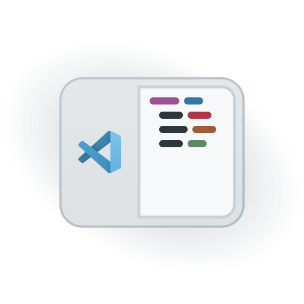
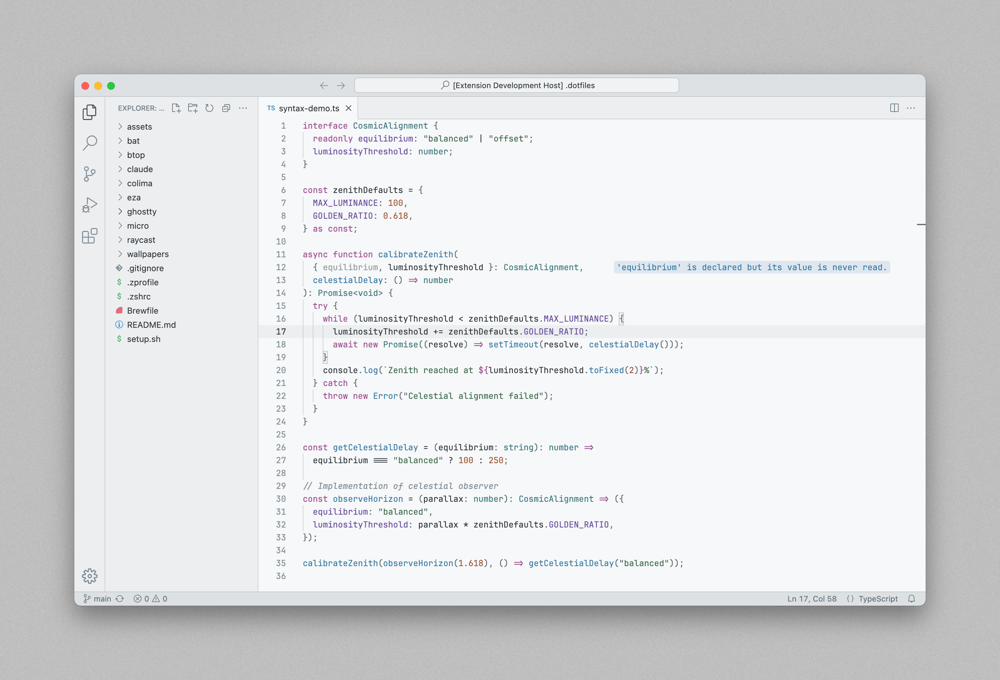

<div align="center">
  
  <h1>Meridian Theme for VS Code</h1>
  <p>
    <strong>A refined light theme with cohesive colors and complete UI coverage.</strong>
    <br>
    Check out the ⭐ dark theme ⭐ here: <a href="https://marketplace.visualstudio.com/items?itemName=britown.vscode-theme-zenith">Zenith Theme for VS Code</a>.
  </p>
  <br>
</div>



## Installation

1. Install theme from the VS Code Marketplace ([direct link](https://marketplace.visualstudio.com/items?itemName=britown.vscode-theme-meridian))
2. Set your `Color Theme` to `Meridian`
3. Set your `File Icon Theme` to `Meridian` for file icons that match the theme colors
4. (Optional) Apply the suggested settings below

## Suggested settings

**Font**

The font in the screenshot is [JetBrains Mono](https://www.jetbrains.com/lp/mono/) with these these settings:

```json
"editor.fontFamily": "JetBrains Mono",
"editor.fontLigatures": true, // If you want ligatures
"editor.fontSize": 13,

"terminal.integrated.fontFamily": "JetBrains Mono",
"terminal.integrated.fontLigatures": true // If you want ligatures
"terminal.integrated.fontSize": 13,
"terminal.integrated.lineHeight": 1.1,
```

**UI elements**

```json
// Tone down the use of colors in Explorer and Editor:
"explorer.decorations.colors": false,
"outline.problems.colors": false,
"workbench.editor.decorations.colors": false,
"editor.bracketPairColorization.enabled": false

// Align icons in Explorer, adjust width of resize indicators, extend editor line highlight into gutter
"workbench.tree.indent": 18,
"workbench.tree.renderIndentGuides": "none",
"workbench.sash.size": 2,
"editor.renderLineHighlight": "all",
```

**Extensions**

Apply these you use the following extensions:

```json
"errorLens.borderRadius": "4px",
"errorLens.margin": "2ch",
"errorLens.messageBackgroundMode": "message",
"errorLens.padding": "1px 4px",

"gitlens.currentLine.fontStyle": "italic",
```

**Other**

All of the theme-related and layout tweaks I use can be found in [suggested-settings.json](https://github.com/bkuzmanoski/vscode-theme-meridian/blob/main/suggested-settings.json) for easy copy-and-pasting.

## Customization

**Add a blue accent to the top active editor tabs**

```json
"workbench.colorCustomizations": {
  "[Meridian]": {
    "tab.activeBorderTop": "#3378a3"
  }
},
```

**Remove the border around matching bracket pairs**

```json
"workbench.colorCustomizations": {
  "[Meridian]": {
    "editorBracketMatch.border": "#00000000",
    "editorBracketMatch.background": "#83909930" // Highlight their background color instead
  }
},
```

**Highlight quotation marks/backticks surrounding strings in green**

```json
"editor.tokenColorCustomizations": {
  "[Meridian]": {
    "textMateRules": [
      {
        "scope": [
          "punctuation.definition.string",
          "punctuation.definition.raw"
        ],
        "settings": {
          "foreground": "#446f53"
        }
      }
    ]
  }
},
```

## Acknowledgments

The syntax highlighting colors were inspired by the "zenwritten_light" Ghostty theme ([mbadolato/iTerm2-Color-Schemes](https://github.com/mbadolato/iTerm2-Color-Schemes)) which was in turn taken from [mcchrish/zenbones.nvim](https://github.com/mcchrish/zenbones.nvim).

The file icon theme uses the Seti UI icons ([jesseweed/seti-ui](https://github.com/jesseweed/seti-ui)).

---

Found a bug or have a request? Please [open an issue](https://github.com/bkuzmanoski/vscode-theme-meridian/issues).
